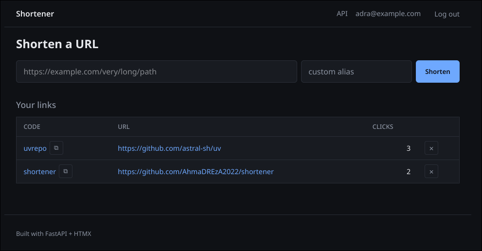

[](https://github.com/AhmaDREzA2022/shortener/actions/workflows/ci.yml)

# Shortener

A small, self-hosted URL shortener with click analytics and custom aliases.

Built with FastAPI, HTMX, Postgres, and Jinja2. No JavaScript build step. No npm.



## Features

- Shorten any URL to a 7-character random code
- Optional custom aliases (e.g. `uvrepo` instead of `aB3xYz9`)
- Click tracking per link
- User accounts with email + password (bcrypt-hashed)
- Session-cookie auth
- Delete your own links
- Copy-to-clipboard
- Dark theme, responsive layout

## Stack

| Layer | Tech |
|---|---|
| Backend | FastAPI, Uvicorn |
| Database | PostgreSQL 16, SQLAlchemy 2.0 (async), Alembic |
| Frontend | Jinja2 templates, HTMX, vanilla CSS |
| Auth | bcrypt (passlib), signed session cookies (Starlette) |
| Tooling | uv, pytest, ruff, Podman / Docker Compose |

## Quick start

Requires: Python 3.12+, [uv](https://docs.astral.sh/uv/), Podman or Docker.

```bash
git clone https://github.com/ahmadrezaa2022/shortener.git
cd shortener
cp .env.example .env

# start Postgres
podman compose up -d

# install deps
uv sync

# run migrations
uv run alembic upgrade head

# start the dev server
uv run uvicorn app.main:app --reload
